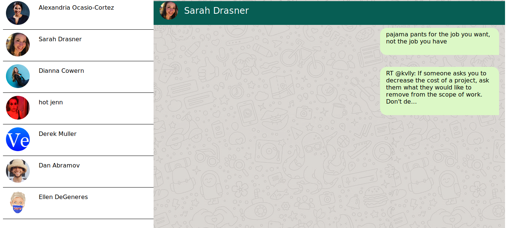

# tweetapp

TweetApp Fetches your Twitter feed and displays it in a Whatsapp like UI
Requires Twitter API access
[Backend](https://github.com/LunaticHacker/tweet-app-backend)



## Project setup

```
yarn install
```

### Compiles and hot-reloads for development

```
yarn serve
```

### Compiles and minifies for production

```
yarn build
```

### Lints and fixes files

```
yarn lint
```

### Customize configuration

See [Configuration Reference](https://cli.vuejs.org/config/).
